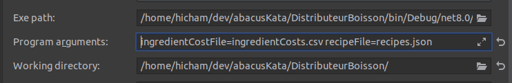
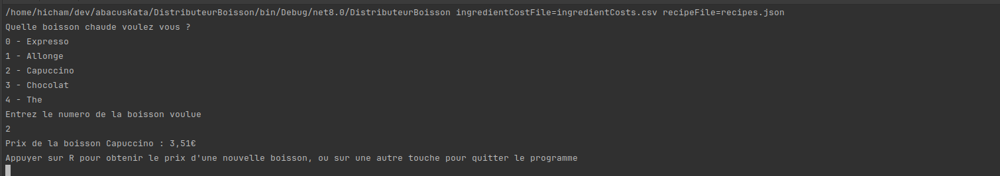

# Distributeurs de boissons
Le point d'entrée se trouve dans DistributeurBoisson/Program.cs

Fichiers d'input :
ingredientCosts.csv --> Contient les prix de chaque ingrédient.
recipes.json --> Contient toutes les recettes avec leur nom et leur composition.

Exemple de commande pour le lancer :
/home/hicham/dev/abacusKata/DistributeurBoisson/bin/Debug/net8.0/DistributeurBoisson ingredientCostFile=/home/hicham/dev/abacusKata/DistributeurBoisson/ingredientCosts.csv recipeFile=/home/hicham/dev/abacusKata/DistributeurBoisson/recipes.json

On peut également modifier le WorkingDirectory pour n'avoir qu'à donner les noms des fichiers en input :

Ce qui donne en arguments :
ingredientCostFile=ingredientCosts.csv
recipeFile=recipes.json

Quand on lance le programme, les fichiers sont chargés et on nous propose de choisir une boisson afin d'obtenir son prix.

Tests unitaires :  
DistributeurBoisson.Tester/DistributeurBoissonTests.cs  
Vérifie que les prix demandés sont bien ceux attendus pour certaines recettes.
